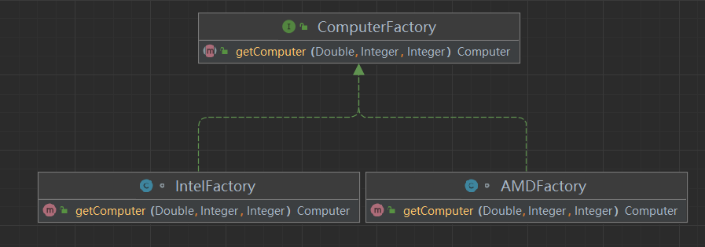
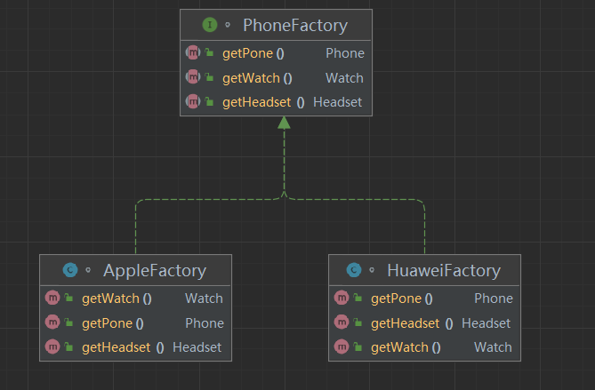
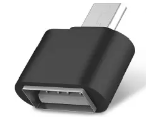

# Java 设计模式

## 设计模式介绍

设计模式是对实际工作中写的各种代码进行抽象总结，其中广为人知的便是

```
Gang of Four
(
	GoF
)
```

他们将设计模式分为 23 种，其中包括三大类

### 创建型模式（Creational Patterns）

这些设计模式提供了一种在创建对象的同时隐藏创建逻辑的方式，而不是使用 new 运算符直接实例化对象。这使得程序在判断针对某个给定实例需要创建哪些对象时更加灵活。

### 结构型模式（Structural Patterns）

这些设计模式关注类和对象的组合。继承的概念被用来组合接口和定义组合对象获得新功能的方式。

### 行为型模式（Behavioral Patterns）

这些设计模式特别关注对象之间的通信。

### 具体分类如下：

```
设计模式
│
│    
├─ 创建型模式（Creational Patterns）
│		├─ 工厂模式（Factory Pattern）√
│		├─ 抽象工厂模式（Abstract Factory Pattern）√
│		├─ 单例模式（Singleton Pattern）√
│		├─ 建造者模式（Builder Pattern）√
│    	└─ 原型模式（Prototype Pattern）√
│    
├─ 结构型模式（Structural Patterns）
│		├─ 适配器模式（Adapter Pattern）√
│		├─ 桥接模式（Bridge Pattern）√
│		├─ 代理模式（Proxy Pattern）√
│		├─ 组合模式（Composite Pattern）
│		├─ 装饰器模式（Decorator Pattern）
│		├─ 外观模式（Facade Pattern）
│		├─ 享元模式（Flyweight Pattern）
│    	└─ 过滤器模式（Filter、Criteria Pattern）
│    
└─ 行为型模式（Behavioral Patterns）
		├─ 责任链模式（Chain of Responsibility Pattern）
		├─ 命令模式（Command Pattern）	
		├─ 解释器模式（Interpreter Pattern）
		├─ 迭代器模式（Iterator Pattern）
		├─ 中介者模式（Mediator Pattern）
		├─ 备忘录模式（Memento Pattern）
		├─ 观察者模式（Observer Pattern）
		├─ 状态模式（State Pattern）
		├─ 空对象模式（Null Object Pattern）
		├─ 策略模式（Strategy Pattern）
		├─ 模板模式（Template Pattern）
		└─ 访问者模式（Visitor Pattern）  
```

### 设计模式的六大原则

设计模式中应当遵循六大原则

**1、开闭原则（Open Close Principle）**

开闭原则的意思是：**对扩展开放，对修改关闭**。在程序需要进行拓展的时候，不能去修改原有的代码，实现一个热插拔的效果。简言之，是为了使程序的扩展性好，易于维护和升级。想要达到这样的效果，我们需要使用接口和抽象类，后面的具体设计中我们会提到这点。

**2、里氏代换原则（Liskov Substitution Principle）**

里氏代换原则是面向对象设计的基本原则之一。 里氏代换原则中说，任何基类可以出现的地方，子类一定可以出现。LSP 是继承复用的基石，只有当派生类可以替换掉基类，且软件单位的功能不受到影响时，基类才能真正被复用，而派生类也能够在基类的基础上增加新的行为。里氏代换原则是对开闭原则的补充。实现开闭原则的关键步骤就是抽象化，而基类与子类的继承关系就是抽象化的具体实现，所以里氏代换原则是对实现抽象化的具体步骤的规范。

**3、依赖倒转原则（Dependence Inversion Principle）**

这个原则是开闭原则的基础，具体内容：针对接口编程，依赖于抽象而不依赖于具体。

**4、接口隔离原则（Interface Segregation Principle）**

这个原则的意思是：使用多个隔离的接口，比使用单个接口要好。它还有另外一个意思是：降低类之间的耦合度。由此可见，其实设计模式就是从大型软件架构出发、便于升级和维护的软件设计思想，它强调降低依赖，降低耦合。

**5、迪米特法则，又称最少知道原则（Demeter Principle）**

最少知道原则是指：一个实体应当尽量少地与其他实体之间发生相互作用，使得系统功能模块相对独立。

**6、合成复用原则（Composite Reuse Principle）**

合成复用原则是指：尽量使用合成/聚合的方式，而不是使用继承。


## 创建型模式

### 工厂模式

工厂模式是一种建造模式，可以避免用户在任意new对象的条件下完成实例的创建。

#### 简单工厂模式

```java
public class FoodFactory {
    public static Food makeFood(String name) {
        if (name.equals("Noodle")) {
            Food noodle = new Noodle();
            noodle.salt();
            return noodle;
        } else if (name.equals("Dumplings")) {
            Food chicken = new Dumplings();
            chicken.vinegar();
            return chicken;
        } else {
            return null;
        }
    }
}
```

如上述代码所示，当我们需要制作食物的时候，就可以调用`FoodFactory`的静态方法，创造对应的食物。

> 根据单一职责原则，通常XxxFactory的职责就是创造Xxx，比如FoodFactory的职责就是创造Food。

#### 工厂模式

虽然简单工厂模式可以解决一些问题，但是可以看到它仍有一些问题。

比如如果我要做一台电脑。电脑制作过程中可以输入参数比如CPU性能，内存性能，硬盘性能等等。

但是在此之前，我首先要考虑，我的电脑使用AMD厂商还是Intel厂商。

因此我们可以创建一个AMD工厂和一个Intel工厂，他们都可以继承一个computer工厂的父类。

```java
public interface ComputerFactory {
    public Computer getComputer(Double cpu,Integer ram,Integer hdd);
}
```

```java
class AMDFactory implements ComputerFactory{

    @Override
    public Computer getComputer(Double cpu,Integer ram,Integer hdd) {
        return new AMDComputer(cpu,ram,hdd);
    }
}
```

```java
class IntelFactory implements ComputerFactory{

    @Override
    public Computer getComputer(Double cpu,Integer ram,Integer hdd) {
        return new IntelComputer(cpu,ram,hdd);
    }
}
```

我们看客户端调用的时候的输出：

```java
class client{
    public static void main(String[] args) {
        //选择工厂
        ComputerFactory computerFactory1 = new AMDFactory();
        Computer computer1 = computerFactory1.getComputer(2.4, 16, 2);
        System.out.println(computer1);

        //选择工厂
        ComputerFactory computerFactory2 = new IntelFactory();
        Computer computer2 = computerFactory2.getComputer(2.9, 8, 1);
        System.out.println(computer2);
    }
}

AMD computer{cpu=2.4GHz, ram=16GB, hdd=2TB}
Intel computer{cpu=2.9GHz, ram=8GB, hdd=1TB}
```

**类关系如图：**



**一个典型的例子**

我们使用日志工厂的时候，首先要指定日志工厂的实现类。

比如FileLogFactory 和 KafkaLogFactory，他们都继承了 LogFactory接口。

### 抽象工厂模式

抽象工厂模式是对工厂模式地一个拓展。

在引入抽象工厂模式的开始，首先介绍产品族的概念，比如华为手机、华为耳机、华为手表都是一共产品族的产品。苹果手机、苹果耳机、苹果手表都是另一产品族的产品。我们可以认为相同产品族的产品的适配性更好，甚至不是统一产品族的产品可以无法相互兼容使用，因而在客户端调用的时候我们希望客户端可以方便地创造同一族的产品。

因而可以在工厂上进行拓展，使得每一个工厂都可以实现同一族不同产品的建造。



客户端：

```java
public class AbstractFactory {
    public static void main(String[] args) {
        PhoneFactory phoneFactory = new HuaweiFactory();
        System.out.printf(phoneFactory.getPone().toString());
        System.out.printf(phoneFactory.getHeadset().toString());
        System.out.printf(phoneFactory.getWatch().toString());
    }
}
```

工厂：

```java
interface PhoneFactory{
    Phone getPone();
    Headset getHeadset();
    Watch getWatch();
}
```

```java
class HuaweiFactory implements PhoneFactory{

    @Override
    public Phone getPone() {
        return new Phone("mate60");
    }

    @Override
    public Headset getHeadset() {
        return new Headset("FreeBuds");
    }

    @Override
    public Watch getWatch() {
        return new Watch("GT3");
    }
}
```

```java
class AppleFactory implements PhoneFactory{
    @Override
    public Phone getPone() {
        return new Phone("iphone");
    }

    @Override
    public Headset getHeadset() {
        return new Headset("AirPods");
    }

    @Override
    public Watch getWatch() {
        return new Watch("Apple Watch");
    }
}
```

**优劣分析**

**优点**：

- 符合依赖抽象原则
- 简化调用者可以方便知道产品族

**缺点**

- 产品族难扩展，修改一个产品需要所有工厂都完成扩展
- 增加了系统的抽象性和理解难度；

### 单例模式

单例模式是最重要一个设计模式之一，他简单、常考但易错

单例模式实现的类**负责创建自己的对象**，同时保证只有一个对象被创建。并且这个类提供了一种**访问**其唯一的对象的方式，在使用中不需要实例化对象，而是直接访问类创建出来的那一个唯一对象。

如此保证了全局只有一个实例对象，避免了对象的频繁创建与销毁，可以很好地节省系统资源。

值得一提的是，在spring中，创建spring bean的默认方式就是单例模式。

#### 懒汉模式

懒汉模式最为简单，但是同时他并不能保证线程安全。也就是当多个线程同时创建时，有可能会创建多个实例对象。

```java
class LazySingleton {
    private static LazySingleton instance;
    // 将 new LazySingleton() 堵死,这是单例模式的精髓所在，将构造器私有化，外界就无法进行自由创建实例了。
    private LazySingleton() {
    }
    // 创建私有静态实例，如果这个类第一次使用的时候就会进行创建。
    public static LazySingleton getInstance() {
        if (instance == null) {
            instance = new LazySingleton();
        }
        return instance;
    }
}
```

客户端调用：

```java
 public static void main(String[] args) {
        Set<LazySingleton> set = new HashSet<>();
        for (int i = 0; i < 10000; i++) {
            new Thread(()->{
                try {
                    Thread.sleep(100);
                    set.add(LazySingleton.getInstance());
                } catch (InterruptedException e) {
                    throw new RuntimeException(e);
                }
            }).start();
        }
        System.out.println(set.size());
    }
```

最终输出可能不是1（结果具有随机性），可见其不并不是线程安全的。

#### 懒汉模式改良

```java
class LazySingleton {
    private static LazySingleton instance;
    // 将 new LazySingleton() 堵死,这是单例模式的精髓所在，将构造器私有化，外界就无法进行自由创建实例了。
    private LazySingleton() {
    }
    // 创建私有静态实例，如果这个类第一次使用的时候就会进行创建。
    public static synchronized LazySingleton getInstance() {
        if (instance == null) {
            instance = new LazySingleton();
        }
        return instance;
    }
}
```

改良后的懒汉模式在 getInstance()方法上加入了 synchronized ，从而保证了线程安全。但是如此效率大幅下降。

#### 饿汉模式

饿汉模式的实例对象在类加载的时候就被初始化

```java
class HungrySingleton {
    private static HungrySingleton instance = new HungrySingleton();
    private HungrySingleton (){}
    public static HungrySingleton getInstance() {
        return instance;
    }
}
```

但是如果调用类的静态方法，也会引起实例对象的初始化，以至于造成不必要的对象被创建，造成资源浪费。

```java
class HungrySingleton {
    private static HungrySingleton instance = new HungrySingleton();
    private HungrySingleton (){}
    public static HungrySingleton getInstance() {
        return instance;
    }
    
    public static Date getData(){
        return new Date();
    }
}
```

比如我们在类中加入了一个方法是查新现在的时间。如果我们只调用getDate类，我们并不希望创建一个实例对象，但是仍然被创建了。

> 如果不能理解为什么调用静态方法的时候也会引起实例对象的初始化，可以看一下jvm类的加载过程。
>
> 简言之调用类的静态方法将会引起类的加载，在此过程中对类的静态成员变量进行初始化。

#### 饱汉模式

饱汉模式可以很好地保障线程安全。

```java
class FullSingleton {
        private FullSingleton() {}
        // 注意此除加入了volatile，保证变量的可见性，这也在初始化的时候其他线程调用就可以及时知道实例对象是否完成了初始化
        private static volatile FullSingleton instance = null;

        public static FullSingleton getInstance() {
            if (instance == null) {
                // 加锁 对类进行加锁，效果是一旦发现实例对象未初始化，那么立刻锁住对象，保证初始化未完成之前的线程只能有序进行操作。
                synchronized (FullSingleton.class) {
                    /* 为什么这里也需要进行判断？ 在上一行的代码进行加锁保证了不同线程对此处的有序进行，如果不判断null，那么放进来
                    的线程将会依次对实例进行初始化，因此判断一个null，就可以保证只有第一个进来的线程可以进行初始化。*/
                    if (instance == null) {
                        instance = new FullSingleton();
                    }
                }
            }
            return instance;
        }
}
```

#### 静态内部类

```java
class StaticSingleton {
    //类的内部存在一个静态内部类，这个内部类初始化过程中会进行实例对象的初始化
    private static class SingletonHolder {
        private static final StaticSingleton INSTANCE = new StaticSingleton();
    }
    private StaticSingleton (){}
    public static final StaticSingleton getInstance() {
        return SingletonHolder.INSTANCE;
    }
}
```

这个方式利用了类加载机制，保证了只有一个线程可以进程线程初始化。

相较于饱汉模式，实现更加简单，但是这种方式只适用于静态域的情况。

#### 枚举类模式

```java
enum EnumSingleton {
    INSTANCE;
    public EnumSingleton getInstance(){
        return INSTANCE;
    }
}
```

类加载模式实现简单、线程安全，只是不支持懒加载

但是他并没有广泛使用开。

### 建造者模式

建造者模式也是一种非常常用的设计模式，它提供了一种创建对象的优雅解决方案。

他的常见形式为创建者对象进行链式编程进行属性赋值，最后build产生对象。

例如：

```java
User user =  User.builder()
		.name()
		.password()
		.email()
		.build();
```

我们可以理解为，将一道复杂的菜品一步一步添加佐料，最终一起放到炒勺里面爆炒出锅。

**代码示例如下：**
客户端调用：

```java
public class Builder {
    public static void main(String[] args) {
        User user = User.builder()
                .name("ounces")
                .password("123")
                .email("123@ounces.com")
                .build();
        System.out.println(user);
    }
}
```

实现建造者模式的类：

```java
class User {
    private String name;
    private String password;
    private String email;

    //由于后面会用到全参构造器，但是我们并不想客户端直接调用我们的构造器构建对象，因此将全参构造器设为私有
    private User(String name, String password, String email) {
        this.name = name;
        this.password = password;
        this.email = email;
    }


    //构造器可以使用一个静态内部类，他的属性应当与所要构造的类相同，如此才能接收到全部参数
    public static class UserBuilder {
        private String name;
        private String password;
        private String email;
        //私有化构造器
        private UserBuilder() {
        }

        // 我们需要链式调用，因此需要返回this，也就是返回一个指向这个对象本身的指针
        public UserBuilder name(String name) {
            this.name = name;
            return this;
        }

        public UserBuilder password(String password) {
            this.password = password;
            return this;
        }

        public UserBuilder email(String email) {
            this.email = email;
            return this;
        }

        //build()方法，将接收到的参数赋予新构建的对象
        //我们可以在build方法中加入一些参数校验规则。
        public User build() {
            if (name == null || password == null) {
                throw new RuntimeException("用户名和密码必填");
            }
            return new User(name,password,email);
        }
    }

    //我们使用userBuilder方法隐藏了new UserBuilder()，是的代码构造器在被使用的时候更加优雅
    public static UserBuilder builder() {
        return new UserBuilder();
    }

    @Override
    public String toString() {
        return "User{" +
                "name='" + name + '\'' +
                ", password='" + password + '\'' +
                ", email='" + email + '\'' +
                '}';
    }
}
```

**代码分析：**

建造者模式可以通过一个静态内部类，因为静态内部类可以在外部类没有实例化的条件下进行实例化。

基本思路为：首先实例化一个静态内部类UserBuilder对象，接下来链式赋值，最后使用 build()方法完成实例化。

链式编程的一个精髓就是返回.this，如此不断将操作后的对象返回并进行下一步操作，从而完成链式操作。

**日常应用**

Lombok的@builder注解便可完成上述一堆代码

```java
@Builder
class LombokUser{
    private String name;
    private String password;
    private String email;
}
```

**特点分析**

首先建造者模式的链式写法使得对字段赋值集中在一起，使代码简洁易懂。不然将会在代码中出现一堆`xxxSet()`方法。

同时可以在build()方法中进行一些参数校验，可以强调出一些必填字段让调用者感知。

### 原型模式

原型模式非常简单，他做的是通过已有对象在保证性能的前提下创建新的对象，拷贝对象。

在Java中就是实现 Cloneable接口，重写clone()方法。

#### 浅拷贝

首先存在一个类叫做Peo，浅拷贝的类中存在这个类的引用类型参数

```java
class Peo{
    public String name;
    public Peo(String name){
        this.name = name;
    }

    @Override
    public String toString() {
        return "Peo{" +
                "name='" + name + '\'' +
                '}';
    }
}
```

代码中如此实现：

```java
class ShallowClone implements Cloneable{
    public int type;
    public Peo peo;
    public ShallowClone(int type,Peo peo){this.type = type;this.peo = peo;}
    public Object Clone(){
        Object clone = null;
        try {
            clone = super.clone();
        } catch (CloneNotSupportedException e) {
            throw new RuntimeException(e);
        }
        return clone;
    }

    @Override
    public String toString() {
        return "ShallowClone{" +
                "type=" + type +
                ", peo='" + peo + '\'' +
                '}';
    }
}
```

客户端调用

```java
public class PrototypePattern {
    public static void main(String[] args) {
        ShallowClone shallowClone = new ShallowClone(1,new Peo("num1"));
        ShallowClone shallowClone1 = (ShallowClone) shallowClone.Clone();
        shallowClone1.type = 2;
        shallowClone1.peo.name = "num2";
        System.out.println(shallowClone);
        System.out.println(shallowClone1);
    }
}
```

结果为：

```
ShallowClone{type=1, peo='Peo{name='num2'}'}
ShallowClone{type=2, peo='Peo{name='num2'}'}
```

可以看到普通数据类型的属性没有问题，但是对克隆后对象的引用类型的属性的修改却引起了原型对象的修改，这是因为两个对象的引用类型属性引用了同一个对象。

为了避免这种情况就需要了深拷贝。

#### 深拷贝

```java
class DeepClone implements Cloneable{
    public int type;
    public Peo peo;
    public DeepClone(int type,Peo peo){this.type = type;this.peo = peo;}
    public Object Clone(){
        try {
            return super.clone();
        } catch (CloneNotSupportedException e) {
            throw new RuntimeException(e);
        }
    }

    @Override
    public String toString() {
        return "DeepClone{" +
                "type=" + type +
                ", peo='" + peo + '\'' +
                '}';
    }
}
```

如此客户端调用：


```java
DeepClone deepClone = new DeepClone(1,new Peo("num1"));
DeepClone deepClone1 = (DeepClone)deepClone.Clone();
deepClone1.type = 2;
deepClone1.peo.name = "num2";
System.out.println(deepClone);
System.out.println(deepClone1);
```

输出结果为：

```
DeepClone{type=1, peo='Peo{name='num1'}'}
DeepClone{type=2, peo='Peo{name='num2'}'}

```

和预计结果相同，克隆后的对象属性改变均为影响模型对象。

但是这个前提是Peo类实现了Cloneable接口，重写了clone()方法

#### 序列化与反序列化

实现类可以实现Serializable接口，并在克隆方法中实现序列化与反序列化操作。

在单纯在clone中很少使用。但是我们经常做的是将类序列化后存放在redis等缓存中。

当再次用到这个对象的时候就进行反序列化得到新的对象。

这个世界上也是原型模式的一个应用


使用序列化的方式方式比较繁琐，这里只是研究设计模式概念便不深入研究。读者可以自行搜索。

## 结构型模式

### 适配器模式

#### 对象适配器

适配器模式是解决接口转化的问题。

就好像是日常生活中使用的插口转化器



如上所示，假如我们需要使用USB接口的移动硬盘，但是我们的手机只有一个Type-C的接口，现在我们就要使用一个适配器解决接口转化的问题。

**示例代码**：

首先定义一个接口，例如USB接口，如果某个类实现了USB接口便可认为这个类有一个USB的接口来实现USB功能（传输数据）

```java
interface USB{
    public void transferData();
}
```

接下来创建一个类实现这个接口，例如我们有一个u盘 ，u盘上面恰好有一个usb的接口

```java
class USBDrive implements USB{

    @Override
    public void transferData() {
        System.out.println("U盘正在传输数据");
    }
}
```

然后定义适配器

```java
class USBTypeCAdapter{
    private USB usb;
    public USBTypeCAdapter(USBDrive usb){
        this.usb = usb;
    }
    @Override
    public void transferData() {
        usb.transferData();
    }
}
```

客户端调用：

```java
public class AdapterPattern {
    public static void main(String[] args) {
        USBDrive usbDrive = new USBDrive();
        USBTypeCAdapter usbTypeCAdapter = new USBTypeCAdapter(usbDrive);
        usbTypeCAdapter.transferData();
    }
}
```

可以看到，我们最后使用的是usbTypeCAdapter的数据传输，而不是直接使用usbDriver的传输

同时我们可以改造一下，令usbTypeCAdapter实现一个 叫做TypeC的接口。

```java
class USBTypeCAdapter implements TypeC{...}
```

客户端使用TypeC类型引用接收对象的引用

```java
 public static void main(String[] args) {
        USBDrive usbDrive = new USBDrive();
        TypeC usbTypeCAdapter =  new USBTypeCAdapter(usbDrive);
        usbTypeCAdapter.transferData();

    }
```

我们更可以直观发现，现在我们客户端可以认为使用typeC的接口而不是Usb的接口了

**如上，我们将一个对象通过适配器的包装，可以通过这个对象类没有实现的接口进行调用**

#### 类适配器模式

对象适配器通常将实例化对象进行包装，但是类适配器并不需要进行示例化，而是在类上直接进行包装。

那么我们思考如果完成这种功能呢？
我们知道类的继承，自类可以继承父类的功能（除非final修饰），如果我们定义了一个子类（适配器类），他继承了适配器需要的接口（需求接口），并且继承了父类，那么他就是父类的一个适配器类了。因为我们在重写接口方法的时候，可以直接调用父类的方法，相当于将父类的方法进行了进一步封装。

**我们来看一个示例**

首先定义一个适配器

```java
interface Adapter{
    void printDate();
}
```

接下来定义需要被适配器修饰的类，也就是上述的父类

```java
class DateInfo{
    public static String getDate(){
      return new Date().toString();
   }
}
```

接下来完成适配器类

```java
class DateAdapter extends DateInfo implements Adapter{

    @Override
     public void printDate() {
        System.out.println(
                "当前时间为："
                +getDate()
        );
    }
}
```

客户端调用

```java
public class ClassAdapterPattern {
    public static void main(String[] args) {
        new DateAdapter().printDate();
    }
}
```

**类适配器与对象适配器的比较**

我们看起来，对象适配器仿佛是将一个个示例的对象进行包装。而类适配器是静态地在类中使用方法进行包装。

在平时仍然是对象适配器的会更为灵活与广泛。

#### 默认适配器

默认适配器最为简单，封装性稍差，但是最好理解。

默认适配器实际上无法认为是一个真正的适配器，因为他只是对需要实现的接口进行了简易化包装。

他的适配器更像是对于用户来说，复杂的接口实现对用户来说更加友善了，但是对于机器来说效果不大。

这里引用[一篇优秀文章](https://juejin.cn/post/6844903695667167240)的例子进行说明

---


我们希望使用`Appache commons-io `包中的 `FileAlterationListener`对文件进行监控

但是此接口定义了十分多的抽象方法，如果我们直接使用此接口，必须实现他的所有方法，无法避免地会造成代码大量地臃肿。

```java
public interface FileAlterationListener {
    void onStart(final FileAlterationObserver observer);
    void onDirectoryCreate(final File directory);
    void onDirectoryChange(final File directory);
    void onDirectoryDelete(final File directory);
    void onFileCreate(final File file);
    void onFileChange(final File file);
    void onFileDelete(final File file);
    void onStop(final FileAlterationObserver observer);
}
```

但是我们往常只希望使用他的创建和删除文件地两个功能，于是我们可以定义如下一个适配器，在这个适配器中，实现了上述地复杂接口，但是所有的方法均置为空方法。当我们需要再使用这个接口的时候，只需要继承这个抽象的适配器对象就可以了，这样就不需要实现所有的方法了。

```java
public class FileAlterationListenerAdaptor implements FileAlterationListener {

    public void onStart(final FileAlterationObserver observer) {
    }

    public void onDirectoryCreate(final File directory) {
    }

    public void onDirectoryChange(final File directory) {
    }

    public void onDirectoryDelete(final File directory) {
    }

    public void onFileCreate(final File file) {
    }

    public void onFileChange(final File file) {
    }

    public void onFileDelete(final File file) {
    }

    public void onStop(final FileAlterationObserver observer) {
    }
}
```

当我们使用的时候，直接继承这个适配器类，选择进行方法地重写。

```java
public class FileMonitor extends FileAlterationListenerAdaptor {
    public void onFileCreate(final File file) {
        // 文件创建
        doSomething();
    }

    public void onFileDelete(final File file) {
        // 文件删除
        doSomething();
    }
}
```


### 代理模式

代理模式顾名思义，是依托别人去完成以一项自己无法完成的认为，或者让被人帮助自己去完成一项任务。

我们在日常中最长遇到的问题就是网络代理。当我们无法连接到某网段的网络的时候，就可以摆脱一个代理服务器，代理服务器可以帮我们进行数据的转发和初步校验。

代理模式 的一个典型例子就是租客和租户的模式。我们知道我们经常需要找中介去买房子或者卖房子。我们研究卖房子这一种行为的时候。我们可以认为房东自己可以卖房子，但是他的人脉等资源少于中介，所以去找中介帮忙。

因此中介需要实现和房东相同的饿功能接口，所以房东和中介需要实现相同的接口。

看一下代码：

**售房接口**

```java
interface SaleHouse{
    void saleHouse(int price,int houseId);
}
```

**房东**

```java
class Landlord implements SaleHouse{

    @Override
    public void saleHouse(int price, int houseId) {
        System.out.printf("以%d的价格卖出%d号房子\n",price,houseId);
    }
}
```

**中介**

```java
class Intermediary implements SaleHouse{

    private SaleHouse landlord;
    public Intermediary(SaleHouse landlord){
        this.landlord = landlord;
    }
    @Override
    public void saleHouse(int price, int houseId) {
        System.out.println("在中介上的帮助下开始交易");
        landlord.saleHouse(price,houseId);
        System.out.println("在中介的帮助下交易完成");
    }
}
```

**客户端**

```java
public static void main(String[] args) {
    Landlord landlord = new Landlord();
    Intermediary intermediary = new Intermediary(landlord);
    intermediary.saleHouse(100,1);
}
```

**JAVA中的代理**

使用java的java.lang.reflect包下提供了一个Proxy类和一个InvocationHandler接口可以实现动态代理

同时也可以使用Spring AOP完成动态代理

### 桥接模式

桥接模式是 降低代码耦合性，减少代码量的一个优秀的解决方案。

我们考虑一个情况

假如我们现在有可口可乐和百事可乐两家 Cola公司，他们现在都可以提供生产Cola的服务。但是现在都没有销售的能力。

如果我们给他们销售的功能，就需要在两家公司分别重构代码，如果是100家公司，就需要重构100份代码，这显然不是我们希望看到的。

于是我们将 Cola公司的原职能和销售职能抽离出来，形成两个业务。

 Cola公司建立一个抽象类，在类中有一个销售接口的示例对象。我们可以通过这个对象提供的销售业务进行 Cola的销售 。

而实现不同的销售方式（如线上销售和线下销售）就只需要分别实现销售接口，并将示例对象传递到 Cola对象中即可了。


这样抽象类中的示例引用和接口之间就形成了一个**桥梁**


 **代码如下**:

**销售接口**

```java
interface Sale{
    void saleCola();
}
```

 **Cola抽象类**

```java
abstract class Cola{
    Sale sale;
    public Cola(Sale sale){
        this.sale = sale;
    }

    public void saleCola(){
        sale.saleCola();
    }

}
```

**Cola实现类**

```java
class PepsiCola extends Cola{

    public PepsiCola(Sale sale) {
        super(sale);
    }
    public void saleCola(){
        System.out.print("百事可乐：");
        super.saleCola();
    }
}
```


```java
class CocaCola extends Cola{

    public CocaCola(Sale sale) {
        super(sale);
    }
    public void saleCola(){
        System.out.print("可口可乐：");
        super.saleCola();
    }

}
```


**销售实现类**

```java
class PhysicalStore implements Sale{

    @Override
    public void saleCola() {
        System.out.println("通过实体店售出");
    }
}
```


```java
class NetworkStore implements  Sale{

    @Override
    public void saleCola() {
        System.out.println("通过网店售出");
    }
}
```

**客户端**

```java
public static void main(String[] args) {
    Sale physicalStore = new PhysicalStore();
    PepsiCola pepsiCola = new PepsiCola(physicalStore);
    pepsiCola.saleCola();
    Sale networkStore = new NetworkStore();
    CocaCola cocaCola = new CocaCola(networkStore);
    cocaCola.saleCola();

}
```


## 行为型模式

